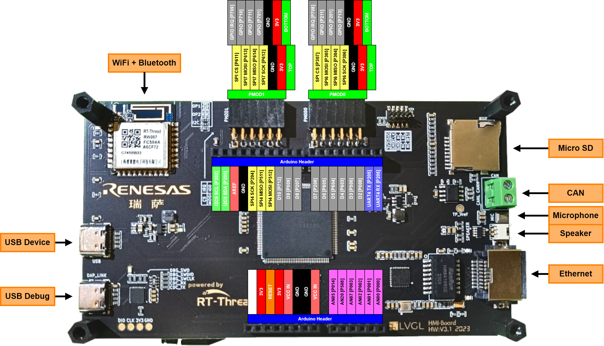
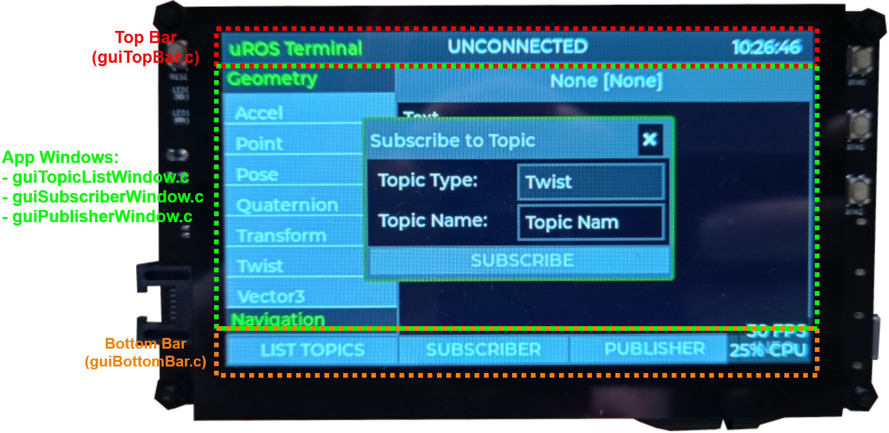

# Micro-ROS (uROS) Terminal UI
This is the firmware for a simple Terminal UI interface for [Micro-ROS](https://micro.ros.org/), allowing to add a simple graphical UI to a [ROS 2](https://www.ros.org/) Robot over a Micro-ROS interface. The board it is running on is the new RT-Thread [HMI-Board](https://blog.lvgl.io/2023-06-14/ra6m3-hmi-board-review) developed by [RT-Thread](www.rt-thread.io) in collaboration with [Renesas](https://www.renesas.com/us/en) and [LVGL](https://lvgl.io/) using the high-performance [RA6M3](https://www.renesas.com/us/en/products/microcontrollers-microprocessors/ra-cortex-m-mcus/ra6m3-32-bit-microcontrollers-120mhz-usb-high-speed-ethernet-and-tft-controller) (Cortex-M4f running at 120 MHz, 2 MB flash and 640 kB RAM) chip from Renesas. This board was kindly provided by RT-Thread, LVGL and Renesas as part of the [Embedded GUI Contest](https://rt-thread.medium.com/2023-embedded-gui-contest-403648de53e4).

The following features are tested and working:
- Create, on request, a Micro-ROS connection to the host PC over a serial link (Baud: 115200 with 8-N-1)
- Subscribe to a Topic and display the returned messages

Features under development but not currently finished:
- List available Topics in the current ROS environment together with its subscriber and publisher nodes: Front-end (Frontend skeleton in place, backend not implemented due to lack of support in used micro-ROS version...)
- Create a Publisher with controllable message content (Both Frontend and Backend under development)

Features planned but not yet started:
- Ethernet based connection

## Demos
A short demo of the GUI Interface working and its current features can be found in the video bellow:

[](https://youtu.be/CsP6N9yULXY "Micro-ROS Terminal UI Demo")

## Hardware

### BOM
- 1x HMI-Board Development Board
- 1x USB-C cable
- 1x USB to UART Bridge (e.g. CP2102 module)

This Micro-ROS Terminal UI interface is being developed with the HMI-Board from RT-Thread. The HMI-Board is based on the high-performance RA6M3 MCU from Renesas with a Cortex-M4f running at 120 MHz and 2 MB of flash and 640 kB of RAM. The board comes with a 4.3" LCD Module (RK043FN66HS-CTG) with a resolution of 480x272 and capacitive touch as well as with a WiFi module and diverse connection options like CAN, Ethernet, USB as well as PMOD and Arduino Headers.

The current version only supports a Micro-ROS connection over serial, specifically over UART4 accessible on the Arduino Header Jxx Pin 1 (RX) and 2 (TX). Bellow is a Figure with the pinout of the HMI-Board together with the default functionality of each pin (as configured in the RA FSP Smart Configurator):



## Software
The GUI Interface runs on the RT-Thread RTOS and uses the [LVGL](www.lvgl.io) embedded graphics library. The GUI Interface project was developed using the RT-Thread IDE, [RT-Thread Studio](www.rt-thread.io/studio.html), and the Micro-ROS interface is based on a [Micro-ROS RT-Thread package](https://github.com/wuhanstudio/micro_ros) with some modifications<sup>1</sup>. The full project files and dependencies are included in this GitHub repository, including both the LVGL and Micro-ROS package (both with some modifications). To run the project it is therefore only necessary to install RT-Thread Studio, download this repository and import this project in RT-Thread Studio.

To debug and flash the board from RT-Thread Studio follow the instruction bellow in the "Flashing and Debugging" Section.

<sup>1</sup> The Micro-ROS packet used is the one for ROS Humble and GCC5, branch "humble-gcc-5". This branch required modifications to be complied which included to move files out of duplicate recursive folders e.g. "src/action_msgs/action_msgs" content is moved to the base folder "src/actions_msgs".

### Adding Peripherals
For this project it was necessary to create/enable a new peripheral that was not yet configured/available in the base project for the HMI-Board: a new serial/UART. To enable the new serial port, UART4 on the Arduino Headers, on the HMI-Board the  steps listed bellow where required. These steps help create the basis to enable and change configurations of peripherals of the HMI-Board.

#### Pre Requisites (Installation)
1) Install [RA FSP Smart Configurator](https://www.renesas.com/us/en/software-tool/ra-smart-configurator), available to download [here](https://github.com/renesas/fsp/releases) (use the IAR or Keil MDK release)
2) Click the "RA Smart Configurator" Link in the RT-Thread project
3) Select the install directory of the **RA Smart Configurator** (e.g. "C:\Renesas\RA\sc_v2023-07_fsp_v4.6.0")

#### Changes/Configuration of new peripherals
It is now possible to open the MCU configuration file with the **RA Smart Configurator** tool by clicking the "RA Smart Configurator" Link in the RT-Thread project. In the **RA Smart Configurator** we can now enable new peripherals and/or change settings of existing ones. As an example on how to enable and configure a new peripheral I'll go through the steps I took to enable UART4:

1) Now open the "Stacks" tab from the bottom of the "FSP Configuration" window on the left side of the screen.
2) Click "New Stack->Connectivity->UART (r_sci_uart)" (for adding UART4 I had to add 5 stacks, uart0 to uart4, and then delete the not desired ones, uart0 to uart3...)
3) Now we can select this newly created stack and configure it by clicking/selecting it and navigating to the bottom of the window where the Stack "Properties" are shown (configuration is based on how UART9 is configured, the default terminal interface).
4) Select the Pins used for UART4
5) Check that the name of the peripheral is set to "g_uart4" (Important as this is how RT-Thread will address it)
6) Set the name of the IRQ callback function, in "Module->Interrupts->Callback" to "user_uart4_callback" (Important as this is how RT-Thread expects the function to be called)
7) Set the UART configuration and Baudrate: Here 115200 and 8-N-1
8) Finally click the "Generate Project Content" Button in the top right corner of the "FSP Configuration" window

#### Post Generation Changes/Configuration
After the new files where generated by the **RA Smart Configurator**, a few additional steps have to be performed back in the RT-Thread IDE:

1) Move generated "memory_regions.ld" from "root" to "/script"
2) Delete the generated "src/hal_entry.c" file
3) Enable/add to build necessary HAL Drivers, both in folders "\rt-thread\components\drivers" and "\libraries\HAL_Drivers"
4) Set required defines in the "rtconfig.h" file
5) It can be necessary to also change the "startup.c" file located at "\ra\fsp\src\bsp\cmsis\Device\RENESAS\Source\startup.c". It should read the following in the Reset Handler function:

```c
void Reset_Handler (void) {
    /* Initialize system using BSP. */
    SystemInit();

    /* Call user application. */
#ifdef __ARMCC_VERSION
    main();
#elif defined(__GNUC__)
    extern int entry(void);
    entry();
#endif

    while (1) {
        /* Infinite Loop. */
    }
}
```
<!--
For RTC (still not working...):

Change "\libraries\HAL_Drivers\drv_common.c" function "void R_BSP_WarmStart (bsp_warm_start_event_t event)":
//https://community.renesas.com/mcu-mpu/ra/f/forum/18972/ra6m4-sub-clock-not-working---bug-fix
-->

### Configuring Micro-ROS to use UART4
The final step is to tell Micro-ROS to use UART4 (or change to other UART desired). This is done through the RT-Thread configuration file, "rtconfig.h", in the section for the Micro ROS packet. Here we can change the "MICRO_ROS_SERIAL_NAME" to "uart4". And that is all, now when a new serial connection is created using the Micro-ROS API it will use UART4.

### Flashing and Debugging
Although the HMI-Board should be supported and work out of the box with the latest RT-Thread IDE, I had some difficulties which had to do with the installed debugger tool (pyOCD) not having the necessary files for the HMI-Board. I solved this by installing pyOCD fresh and use that instead of the one that came with the RT-Thread IDE. The steps for this are listed bellow:
1) Install pyOCD with: py -m pip install -U pyocd
2) Install support for HMI-Board with: pyocd pack install R7FA6M3AH
3) Changed pyOCD location in the RT-Thread IDE: Debugger settings->Debugger->Executable path = "C:\Python311\Scripts\pyocd.exe". If the path is not know it can be obtained from a Python terminal with the following commands: "import pyOCD" and	"print(pyOCD.\_\_file\_\_)"

### Architecture
The GUI Interface firmware is composed of three main modules, each responsible for a specific function and running as their own thread:

- GUI: Thread responsible to draw the GUI, react to GUI events and update the GUI
- uROS: Thread running Micro-ROS, handling the connection, subscribers, publishers and events.

To manage communication between threads, each thread has its own message queue where other threads, and the ISR in some cases, publish necessary messages to. A standard message type is defined as the **InterThreadMessageStruct**: It holds an ID/OpCode, a pointer to data and a data length field. In cases where the data fits directly into the data pointer, aka data that fits in 4 bytes, it is passed by value and not through a pointer.

For example, when we want to display information about a Topic by selecting the Topic Type in the SUBSCRIBE window, entering the Topic Name and then clicking the SUBSCRIBE button, the following steps are performed in the background:
1) The GUI thread sends a "Subscribe to Topic" request to the uROS Thread with an OpCode specific to the topic type and the topic name as a pointer in the data field
2) The uROS Thread gets the new request and:
	- Unsubscribes from the previously subscribed topic (if any)
	- Performs necessary clean ups (free variables)
	- Subscribes to the new Topic
3) Now when the uROS Thread gets a new message of the subscribed topic it informs the GUI over the queue with the same OpCode and with the pointer of the received message in the data field
4) The GUI thread gets the new message and displays it on the screen

This process assures that any updates to the GUI are performed ONLY by the GUI Thread, keeping the GUI thread safe as the LVGL library by itself is not. The same for Micro-ROS updates. To get this functionality easily with LVGL we have to insert a call to our own GUI Update Function, this can be done simply by modifying the **lvgl_thread_entry** function (packages\LVGL-v8.3.0\env_support\rt-thread\lv_rt_thread_port.c) and adding our external gui update handling function in the while loop:

```c
/* handle the tasks of LVGL */
while(1)
{
	lv_user_gui_update();							//User GUI Update Call
	lv_task_handler();								//LVGL GUI Thread Handler
	rt_thread_mdelay(LV_DISP_DEF_REFR_PERIOD);		//Refresh rate of the GUI
}
```

Another way to keep the GUI thread safe would be to wrap the **lv_task_handler** function and any LVGL (**lv_xxx**) function calls with a mutex, as described in the LVGL [documentation](https://docs.lvgl.io/master/porting/os.html), but this is more complex and incurs higher overhead.

To manage the GUI better it is split into different areas, with each area being separated into there own source and header files:

